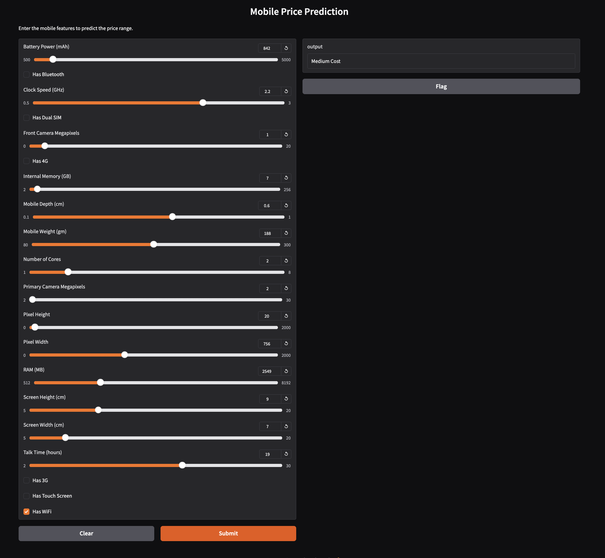

# Mobile Phone Price Prediction

## Objective
This project is part of my machine learning internship at Unified Mentor. The goal of this project was to develop a system that can predict the pricing category (Low, Medium, High, or Very High) of mobile phones based on their features.

## Dataset
The dataset used in this project contains information on various mobile phones, such as technical specifications and pricing categories. The task is to predict the price range of a mobile phone based on its features.

### Integer Classification of the Price Range:
- 0 - Low Cost
- 1 - Medium Cost
- 2 - High Cost
- 3 - Very High Cost

### Description of main columns:
- **battery_power**: Battery capacity in mAh
- **blue**: Whether the phone has Bluetooth (1 = Yes, 0 = No)
- **clock_speed**: Processor speed in GHz
- **dual_sim**: Whether the phone supports dual SIM (1 = Yes, 0 = No)
- **fc**: Front camera megapixels
- **four_g**: Whether the phone supports 4G (1 = Yes, 0 = No)
- **int_memory**: Internal memory in GB
- **m_deep**: Depth of the phone in cm
- **mobile_wt**: Weight of the phone in grams
- **n_cores**: Number of processor cores
- **pc**: Primary camera megapixels
- **px_height**: Height of the screen resolution in pixels
- **px_width**: Width of the screen resolution in pixels
- **ram**: RAM size in MB
- **sc_h**: Screen height in cm
- **sc_w**: Screen width in cm
- **talk_time**: Maximum talk time per battery charge in hours
- **three_g**: Whether the phone supports 3G (1 = Yes, 0 = No)
- **touch_screen**: Whether the phone has a touch screen (1 = Yes, 0 = No)
- **wifi**: Whether the phone has WiFi (1 = Yes, 0 = No)

## Approach
To achieve accurate price range predictions, I explored various machine learning models. Initially, I used the **RandomForest Classifier** and achieved a decent accuracy of 86%. However, in pursuit of better accuracy, I decided to implement **XGBoost**, a more advanced and powerful gradient boosting algorithm. After tuning the hyperparameters, XGBoost provided a higher accuracy of **91%**.

### Model Details:
1. **RandomForest Classifier**: Initial accuracy of 86%.
2. **XGBoost Classifier**: Fine-tuned accuracy of 91%.

## Training the Classifier Models
- RandomForest and XGBoost classifiers were trained using various mobile phone features.
- The input features were scaled using a **StandardScaler** to normalize the values.
- The final XGBoost model was saved as a pickle file for deployment.

## Running the Mobile Phone Price Prediction System
1. Load the saved **xgboost_model.pkl** file and update the path to the model in the `app.py` file.
2. Run the `app.py` file using the command `python app.py`.
3. Input the required phone features in the prediction interface and the system will output the predicted price range.

## Gradio App for Prediction
- A simple Gradio-based app is provided to collect user input (phone features) and predict the price category using the trained XGBoost model.
- The app scales the input features using predefined scaling parameters before passing them to the model.

## Screenshots

